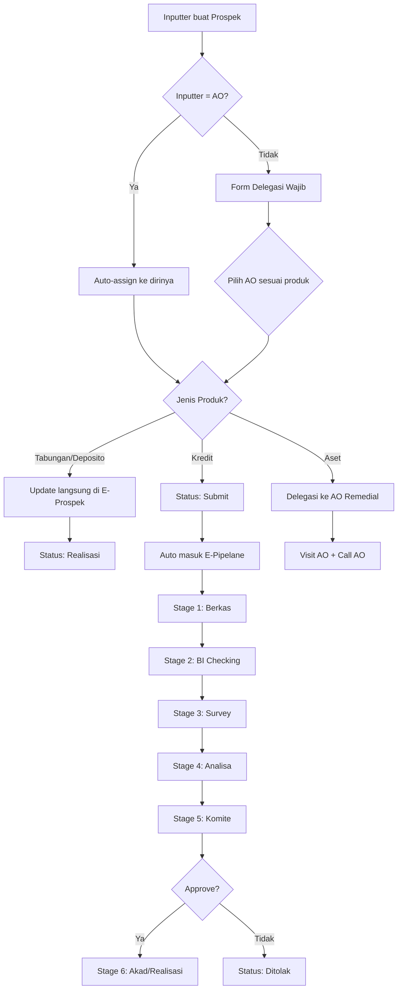
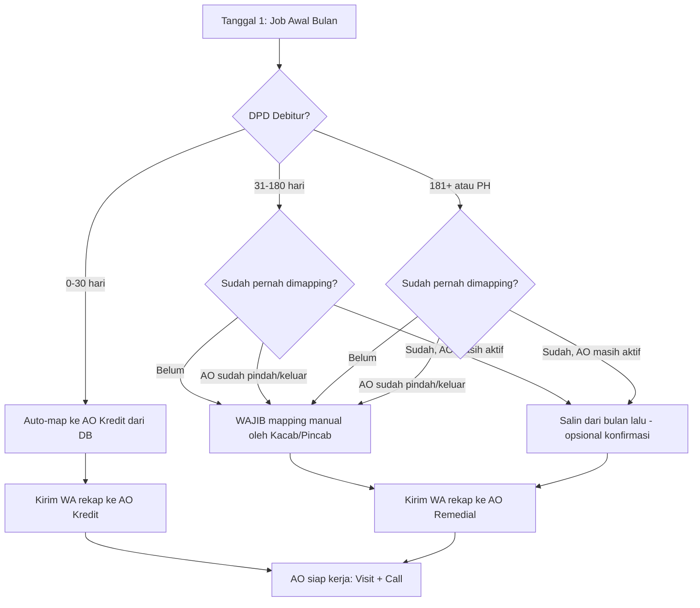
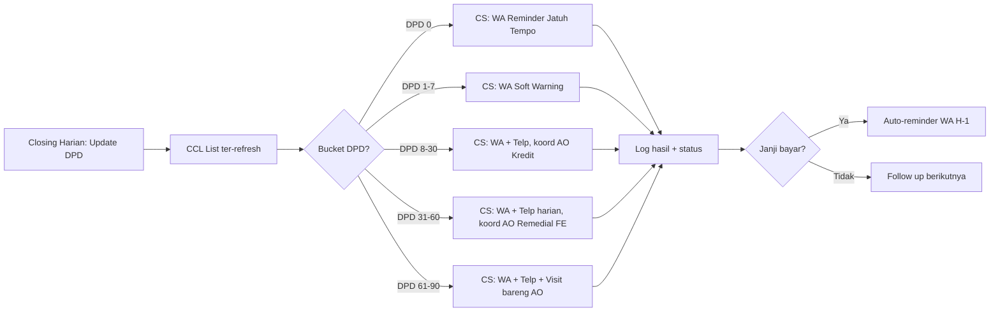

# BKK Nexus — AO Credit Operating System

> Sistem operasional terintegrasi untuk **AO Kredit, AO Remedial, dan CS** beserta jajaran atasannya (Kabid Pemasaran, Kepala Cabang, Pincab) di lingkungan Bank Perkreditan Rakyat (BPR).
>
> Tujuan utama: **memudahkan pendataan calon debitur, mempercepat delegasi tugas ke AO yang tepat, mengontrol SLA proses kredit, serta merapikan kunjungan & komitmen awal bulan AO.**

---

## Daftar Isi

1. [Ringkasan & Tujuan Bisnis](#1-ringkasan--tujuan-bisnis)
2. [Pengguna & Hak Akses (Roles)](#2-pengguna--hak-akses-roles)
3. [Mapping Debitur Awal Bulan](#3-mapping-debitur-awal-bulan)
4. [Modul Utama](#4-modul-utama)
   - 4.1 [Dashboard](#41-dashboard)
   - 4.2 [E-Prospek](#42-e-prospek)
   - 4.3 [E-Pipelane (Credit SLA)](#43-e-pipelane-credit-sla)
   - 4.4 [Visit AO](#44-visit-ao)
   - 4.5 [Call AO](#45-call-ao)
5. [Aturan Delegasi](#5-aturan-delegasi)
6. [Diagram Alur Sistem](#6-diagram-alur-sistem)
7. [Notifikasi & SLA](#7-notifikasi--sla)
8. [Model Data (ERD Ringkas)](#8-model-data-erd-ringkas)
9. [Rencana API](#9-rencana-api)
10. [Autentikasi (SSO)](#10-autentikasi-sso)
11. [Tech Stack](#11-tech-stack)
12. [Struktur Folder](#12-struktur-folder)
13. [Setup & Pengembangan Lokal](#13-setup--pengembangan-lokal)
14. [Roadmap Pengembangan](#14-roadmap-pengembangan)

---

## 1. Ringkasan & Tujuan Bisnis

**BKK Nexus** adalah sistem internal yang menjadi *single source of truth* untuk seluruh siklus calon debitur — dari pertama kali ditemukan/diinput, didelegasikan ke AO, dikunjungi, sampai diproses kredit (atau langsung di-update untuk produk tabungan/deposito).

### Masalah yang Diselesaikan

| Masalah Saat Ini | Solusi BKK Nexus |
| --- | --- |
| Data calon debitur tersebar di buku/Excel/WA | Modul **E-Prospek** terpusat dengan kategori produk |
| Atasan kesulitan mendelegasi prospek ke AO yang tepat | **Auto-suggest & wajib delegasi** sesuai jenis produk |
| Proses kredit tidak terukur waktunya (SLA bocor) | **E-Pipelane** dengan timeline status & SLA per tahap |
| Kunjungan AO tidak terpantau atasan | **Visit AO** dengan history, rekap komitmen, dan mapping debitur |
| Tidak ada pemisahan beban kerja AO Kredit & Remedial | **Mapping debitur otomatis** berdasarkan hari menunggak |
| Tabungan/Deposito harus melalui prosedur panjang | **Direct update** dari E-Prospek ke core system |

### Pengguna Sasaran

- **AO Kredit** — kelola prospek baru, proses pengajuan kredit, kunjungan debitur lancar
- **AO Remedial (Front End / Back End)** — tagih & visit debitur menunggak
- **CS (Customer Service)** — input prospek dari walk-in / telepon, **eksekusi CCL via WhatsApp** untuk debitur DPD 0–90
- **PS (Pejabat Struktural)** — pejabat struktural di unit/cabang (Kabid, Kasi, Kasubsi, dll), akses CCL untuk monitoring/eskalasi
- **PE (Pejabat Eksekutif)** — pejabat eksekutif yang **hanya ada di Kantor Pusat & level Kacab**, akses CCL & monitoring lintas cabang
- **Kabid Pemasaran** — delegasi prospek, monitor pipeline AO (sub-bagian dari PS)
- **Kepala Cabang / Pincab** — approval, monitor cabang, mendelegasi, mapping AO Remedial awal bulan
- **Admin** — manajemen master data, role, mapping

> Catatan: hierarki kasarnya **PE** (Pusat & Kacab) ⟶ **PS** (Pejabat Struktural di unit) ⟶ AO/CS sebagai pelaksana. Konfirmasi mapping detail di `config/role_mapping.php` agar selaras dengan SSO (`job_position` & `level`).

---

## 2. Pengguna & Hak Akses (Roles)

| Role | Bisa Input Prospek | Bisa Delegasi | Bisa Update Pipeline | Bisa Visit | Akses CCL | Lihat Semua AO |
| --- | --- | --- | --- | --- | --- | --- |
| `admin` | ✅ | ✅ | ✅ | — | ✅ | ✅ |
| `pincab` (Pimpinan Cabang) | ✅ | ✅ (wajib) | Approve | — | ✅ (cabangnya) | ✅ (cabangnya) |
| `kacab` (Kepala Cabang) | ✅ | ✅ (wajib) | Approve | — | ✅ (cabangnya) | ✅ (cabangnya) |
| `kabid_pemasaran` | ✅ | ✅ (wajib) | Monitor | — | ✅ (timnya) | ✅ (timnya) |
| `ps` (Pejabat Struktural) | ✅ | ✅ | Monitor | — | ✅ (unit/cabangnya) | ✅ (unit/cabangnya) |
| `pe` (Pejabat Eksekutif — Pusat & Kacab) | ✅ | ✅ | Monitor | — | ✅ (lintas/seluruh cabang) | ✅ (lintas/seluruh cabang) |
| `ao_kredit` | ✅ | — | ✅ (sendiri) | ✅ | — | ❌ (sendiri) |
| `ao_remedial_fe` | ✅ | — | ✅ (sendiri) | ✅ | — | ❌ (sendiri) |
| `ao_remedial_be` | ✅ | — | ✅ (sendiri) | ✅ | — | ❌ (sendiri) |
| `cs` | ✅ | — | — | — | ✅ (eksekutor) | ❌ |

### Aturan Penting

- Jika **inputter bukan AO** (CS, Kabid, Kacab, Pincab), sistem **wajib menampilkan dialog delegasi** sebelum data tersimpan final. Prospek tidak bisa "mengambang" tanpa AO.
- AO hanya bisa melihat & mengelola prospek/debitur **yang didelegasikan kepadanya**.
- Atasan (Kacab/Pincab/Kabid) bisa **override** delegasi dan memindahkan prospek ke AO lain.

---

## 3. Mapping Debitur Awal Bulan

Setiap **tanggal 1**, sistem membagi debitur ke AO berdasarkan **hari menunggak** (DPD). Aturan mapping berbeda antara AO Kredit dan AO Remedial:

| Kategori | Hari Menunggak | Ditangani Oleh | Jenis Mapping | Modul Aktif |
| --- | --- | --- | --- | --- |
| Lancar / Calon Baru | 0 – 30 hari | **AO Kredit** | 🤖 **Otomatis** dari database | E-Prospek, E-Pipelane, Visit AO |
| Menunggak Ringan | 31 – 180 hari | **AO Remedial FE** (Front End) | ✍️ **Wajib manual** awal bulan | Visit AO, Call AO |
| Menunggak Berat / PH | 181+ hari atau status PH (Penghapusbukuan) | **AO Remedial BE** (Back End) | ✍️ **Wajib manual** awal bulan | Visit AO, Call AO |

### 3.1 AO Kredit — Mapping Otomatis

- Sistem **menarik langsung dari core banking / database debitur** setiap awal bulan.
- Field acuan: `kode_ao` / `petugas` di tabel debitur. Debitur dengan DPD 0–30 yang `kode_ao` = AO Kredit X otomatis terdaftar di list-nya.
- **Tidak perlu intervensi manual** kecuali ada koreksi/perpindahan AO.

### 3.2 AO Remedial (FE & BE) — Wajib Mapping Manual

Berbeda dengan AO Kredit, **mapping AO Remedial WAJIB dilakukan secara manual** oleh atasan (Kacab/Pincab/Kabid) **setiap awal bulan**, dalam dua kondisi:

1. **Belum pernah dimapping** — debitur baru masuk kategori menunggak (DPD lewat 30 hari).
2. **AO sebelumnya sudah pindah/keluar/rotasi** — perlu reassign ke AO Remedial yang baru.

> ⚠️ Sistem akan **memblokir akses modul Visit AO & Call AO untuk role Remedial** sampai mapping awal bulan selesai dilakukan oleh atasan. Notifikasi reminder dikirim ke Kacab/Pincab tanggal 1, dan eskalasi ke Pincab pusat jika belum selesai sampai tanggal 5.

#### Fitur Mapping Manual

- **Bulk assignment**: pilih banyak debitur sekaligus → assign ke 1 AO Remedial
- **Drag & drop interface** (opsional di fase lanjut)
- **Bulanan snapshot**: hasil mapping bulan ini disimpan ke tabel `debitur_assignments` dengan kolom `effective_month` (YYYY-MM)
- **Salin dari bulan lalu**: tombol "Copy mapping bulan lalu" untuk debitur yang AO-nya tidak berubah
- **Notifikasi WhatsApp** otomatis ke AO yang baru di-assign (lihat [bagian 3.3](#33-notifikasi-mapping-via-whatsapp))

### 3.3 Notifikasi Mapping via WhatsApp

Setelah mapping selesai (baik otomatis untuk AO Kredit maupun manual untuk AO Remedial), sistem mengirim **notifikasi WhatsApp** ke AO bersangkutan berisi:

- Jumlah total debitur yang di-handle bulan ini
- Breakdown per kategori DPD
- Total baki debet / outstanding
- Link langsung ke modul Visit AO untuk melihat list lengkap

> Integrasi WA dilakukan via WA Gateway (Fonnte / Wablas / WhatsApp Business API). Konfigurasi token di `config/env.php`.

---

## 4. Modul Utama

### 4.1 Dashboard

Halaman utama yang menampilkan **ringkasan performa sesuai role**.

- **AO**: target pipeline bulan, progress visit, prospek panas (hot leads), rekap komitmen vs realisasi.
- **Kabid / Kacab / Pincab**: agregat semua AO di bawahnya, ranking AO, alert SLA terlewat, prospek yang belum didelegasikan.
- **CS**: jumlah prospek yang ia input, status delegasinya.

### 4.2 E-Prospek

Modul input data **calon debitur** untuk semua produk Bank.

#### Jenis Produk yang Didukung

| Produk | Alur Selanjutnya | Dikerjakan Oleh |
| --- | --- | --- |
| **Tabungan** | Update langsung di E-Prospek → mark sebagai "Realisasi" | AO Kredit |
| **Deposito** | Update langsung di E-Prospek → mark sebagai "Realisasi" | AO Kredit |
| **Kredit** (KMK, KI, KPR, Multiguna, dst) | Otomatis masuk ke **E-Pipelane** untuk proses SLA | AO Kredit |
| **Aset** (jaminan/agunan terkait remedial) | Diteruskan ke AO Remedial untuk follow-up | AO Remedial |

#### Field Wajib

- Identitas: nama usaha/debitur, pemilik, NIK, no. telepon
- Lokasi: alamat lengkap, kab/kec/kel (cascading dropdown), geolocation (lat/lng), foto lokasi/usaha
- Produk: jenis produk (tabungan/deposito/kredit/aset), nominal, tujuan
- Score otomatis: HOT (≥80) / WARM (60–79) / COLD (<60) berdasarkan rule engine
- Catatan & sumber prospek (walk-in, referral, kanvasing, dll)

#### Status Prospek

`open` → `pending` → `submit` → (Kredit: lanjut Pipelane) / (Tabungan & Deposito: `realisasi`) atau `reject`

#### Aturan Khusus

- **Jika inputter bukan AO** → modal delegasi muncul setelah submit form. Inputter wajib pilih AO target sesuai mapping produk.
- **Jika prospek sudah diambil/diproses AO** → tombol delete dikunci. Hanya bisa di-update.
- AO yang ditugaskan **wajib mengisi data tambahan AO** (jenis usaha, lama usaha, omzet, jaminan) sebelum bisa submit ke pipeline.

### 4.3 E-Pipelane (Credit SLA)

Modul khusus untuk produk **Kredit** — meneruskan dari E-Prospek (status `submit`) sampai keputusan akhir.

#### Tahapan Proses (Stages)

| # | Stage | SLA Default | PIC |
| --- | --- | --- | --- |
| 1 | Pengumpulan Berkas | 2 hari | AO Kredit |
| 2 | BI Checking / SLIK | 1 hari | AO Kredit |
| 3 | Survey Lapangan | 2 hari | AO Kredit |
| 4 | Analisa Kredit | 2 hari | AO Kredit |
| 5 | Komite Kredit / Approval | 2 hari | Kacab / Komite |
| 6 | Akad / Realisasi | 1 hari | AO + CS |
| 7 | **Diterima** atau **Ditolak** | — | Final state |

> Setiap perpindahan stage **wajib di-update** oleh AO. Jika stage melebihi SLA, akan muncul alert di dashboard atasan.

#### Fitur Utama

- Timeline visual per pengajuan (kanban/horizontal stepper)
- Upload dokumen per stage (KTP, KK, NPWP, slip gaji, agunan, hasil survey, dll)
- Catatan per stage + log perubahan (audit trail)
- Notifikasi otomatis saat SLA mendekati / terlewat
- Laporan SLA (per AO, per cabang, per produk)

### 4.4 Visit AO

Modul untuk mencatat **kunjungan AO ke debitur/calon debitur**.

#### Sub-fitur

1. **Jadwal Visit** — kalender harian/mingguan kunjungan
2. **Riwayat Visit** — daftar kunjungan yang sudah dilakukan + foto + GPS check-in
3. **Tambah Visit** — form input kunjungan dengan geotagging wajib
4. **Peta Lokasi** — visualisasi semua debitur di peta (clustering by status)
5. **Komitmen Awal Bulan** — AO input target jumlah visit & nominal closing/penagihan di awal bulan
6. **Rekap Bulanan** — perbandingan komitmen vs realisasi (target vs actual)

#### Daftar Debitur AO

Setiap AO memiliki **daftar debitur yang di-mapping** ke dirinya (lihat [bagian 3](#3-mapping-debitur-awal-bulan)).

- AO Kredit: hanya debitur **0–30 hari menunggak** + calon debitur dari E-Prospek
- AO Remedial FE: debitur **31–180 hari**
- AO Remedial BE: debitur **181+ hari & PH**

Setiap visit harus terikat ke debitur dalam mapping AO tersebut. Jika kunjungan ke debitur di luar mapping, perlu approval atasan.

### 4.5 Call AO / CCL (Customer Care List)

Modul untuk **panggilan & WhatsApp ke debitur** sebagai langkah preventif & tagihan dini sebelum debitur jatuh ke kategori remedial berat.

#### 4.5.1 CCL — Customer Care List (Eksekutor: CS)

**CCL adalah aktivitas CS untuk menghubungi (terutama via WhatsApp) debitur dengan DPD 0–90 hari** sebagai upaya preventif & reminder pembayaran. Aktivitas ini berjalan **paralel** dengan kerja AO Kredit dan AO Remedial FE — bukan menggantikan.

**Tujuan**: cegah debitur DPD 0–30 naik ke kategori menunggak, dan bantu AO Remedial FE pada DPD 31–90.

#### 4.5.2 Bucket DPD untuk CCL

Data debitur di CCL **dikelompokkan berdasarkan DPD by closing** (posisi akhir hari/closing) menjadi 5 bucket:

| Bucket | DPD | Prioritas | Strategi Komunikasi |
| --- | --- | --- | --- |
| **DPD 0** | 0 hari (lancar, jatuh tempo hari ini / besok) | Reminder | WA broadcast template "Reminder Jatuh Tempo" |
| **DPD 1–7** | 1–7 hari | Soft warning | WA personal + tanya kendala |
| **DPD 8–30** | 8–30 hari | Aktif follow-up | WA personal + telepon, koordinasi dengan AO Kredit |
| **DPD 31–60** | 31–60 hari | Eskalasi | WA + telepon harian, koordinasi dengan AO Remedial FE |
| **DPD 61–90** | 61–90 hari | Critical | WA + telepon + visit (bareng AO Remedial FE) |

> Debitur DPD 91+ **keluar dari CCL** dan murni ditangani AO Remedial (FE/BE) via modul Visit AO.

#### 4.5.3 Akses CCL

| Role | Akses | Aksi |
| --- | --- | --- |
| `cs` | ✅ Eksekutor utama | Lihat list, kirim WA, log hasil call/WA |
| `ps` (Pejabat Struktural) | ✅ Monitor + eksekusi | Lihat list di unit/cabangnya, eksekusi jika diperlukan, eskalasi |
| `pe` (Pejabat Eksekutif — Pusat & Kacab) | ✅ Monitor + eksekusi | Lihat list lintas cabang (Pusat) atau cabangnya (Kacab), eskalasi |
| `kacab` / `pincab` | ✅ Monitor | Lihat performa CCL cabang, laporan |
| `ao_kredit` / `ao_remedial` | 👁️ Read-only | Lihat history CCL atas debiturnya (sinergi) |

> CCL **tidak bisa diakses oleh AO** untuk eksekusi karena memang fokus AO ada di Visit & proses kredit. AO hanya melihat hasil CCL untuk konteks.

#### 4.5.4 Fitur CCL

1. **Dashboard CCL** — total debitur per bucket DPD, % tercover, % janji bayar, % bayar sesudah CCL
2. **List Debitur per Bucket** — filter per cabang, AO, produk, nominal
3. **Kirim WA** — single atau bulk, dengan **template message** yang bisa di-edit (per bucket)
4. **Log Hasil**:
   - Status: `terkirim`, `dibaca`, `direspon`, `tidak respon`, `nomor mati`
   - Hasil: `janji bayar (tanggal)`, `sudah bayar`, `keberatan`, `pindah domisili`, `tidak bisa dihubungi`
5. **Riwayat Komunikasi** — timeline lengkap CCL + Call + Visit per debitur (gabungan seluruh kanal)
6. **Reminder Janji Bayar** — auto-reminder ke debitur H-1 janji bayar via WA
7. **Laporan Harian/Mingguan** — produktivitas CS, conversion rate (janji → realisasi)

#### 4.5.5 Integrasi WhatsApp

- **Gateway**: Fonnte / Wablas / WhatsApp Business Cloud API (TBD, dipilih saat implementasi)
- **Template per bucket** disimpan di tabel `wa_templates` agar bisa di-edit oleh admin tanpa deploy
- **Variable substitution**: `{nama}`, `{nominal}`, `{tgl_jatuh_tempo}`, `{dpd}`, `{nama_ao}`, dll
- **Rate limit & antrian** untuk hindari WA banned saat broadcast besar

#### 4.5.6 Call AO (untuk AO Remedial)

Selain CCL yang dioperasikan CS, AO Remedial tetap punya modul **Call AO** sendiri untuk:

- Mencatat panggilan telepon ke debitur menunggak (DPD 31+)
- Riwayat call (in/out, durasi, hasil)
- Status hasil: `kontak`, `tidak kontak`, `janji bayar`, `keberatan`, `nomor mati`
- Jadwal follow-up
- Laporan harian per AO

> Data Call AO dan CCL **terhubung di tabel yang sama (`communications`)** dengan field `channel` (call/wa) dan `executor_role` (cs/ao). Sehingga riwayat komunikasi debitur tetap utuh terlepas siapa yang menghubungi.

---

## 5. Aturan Delegasi

Inilah inti yang dirumuskan user — **siapa input, didelegasi ke siapa**:

```
                    [ INPUTTER ]
                          |
              +-----------+------------+
              |                        |
         AO langsung               Bukan AO (CS, Kabid,
        (auto = dirinya)            Kacab, Pincab)
              |                        |
              |                        v
              |                 [ WAJIB DELEGASI ]
              |                        |
              v                        v
      +---------------+        +---------------+
      | Jenis Produk? |        | Jenis Produk? |
      +-------+-------+        +-------+-------+
              |                        |
   ___________|___________   __________|___________
   |       |        |    |   |       |       |    |
 Tab.   Depo.    Kredit Aset Tab.  Depo.  Kredit Aset
   |       |        |    |   |       |       |    |
   v       v        v    v   v       v       v    v
 Update  Update  E-Pipe Remed Deleg Deleg  Deleg  Deleg
 langsg  langsg  -lane  ial   ke AO ke AO  ke AO  ke AO
 (real)  (real)  proses follow Kredit Kredit Kredit Remed
                 SLA   -up                       ial
```

### Matriks Delegasi

| Produk | Delegasi Otomatis Ke | Modul Tujuan |
| --- | --- | --- |
| Tabungan | AO Kredit | E-Prospek (update langsung → realisasi) |
| Deposito | AO Kredit | E-Prospek (update langsung → realisasi) |
| Kredit | AO Kredit | E-Pipelane (proses SLA) |
| Aset | AO Remedial (FE atau BE sesuai mapping debitur) | Visit AO + Call AO |

### Rule Validasi

- Form delegasi **tidak bisa dilewati** jika inputter bukan AO.
- Jika di cabang tertentu **tidak ada AO** untuk jenis produk tersebut → fallback ke Kacab / muncul peringatan.
- Atasan dapat **re-delegasi** kapan saja (perubahan tercatat di audit log).

---

## 6. Diagram Alur Sistem

### 6.1 Alur E-Prospek → E-Pipelane (Kredit)



### 6.2 Alur Mapping Debitur Awal Bulan



### 6.3 Alur CCL (CS via WhatsApp)



---

## 7. Notifikasi & SLA

### Channel Notifikasi (rencana)

- In-app notification (bell di navbar)
- Email (untuk delegasi & SLA terlewat)
- **WhatsApp** (mapping awal bulan, reminder janji bayar, broadcast CCL) — **wajib** karena jadi kanal eksekusi CCL

### Trigger Notifikasi

| Event | Penerima | Channel |
| --- | --- | --- |
| Prospek baru didelegasikan ke saya | AO target | In-app + WA |
| Stage E-Pipelane dipindahkan | AO + atasan | In-app |
| SLA stage **mendekati** (H-1) | AO | In-app + WA |
| SLA stage **terlewat** | AO + atasan | In-app + WA + Email |
| Komitmen visit awal bulan belum diisi (tgl 3) | AO + atasan | In-app + WA |
| Visit hari ini belum dilakukan (akhir hari) | AO | In-app |
| **Mapping AO Kredit selesai (auto, tgl 1)** | AO Kredit | In-app + **WA** (rekap bulanan) |
| **Mapping AO Remedial belum dilakukan (tgl 1)** | Kacab/Pincab | In-app + WA |
| **Mapping AO Remedial belum dilakukan (tgl 5)** | Pincab pusat | In-app + WA + Email (eskalasi) |
| **Mapping AO Remedial selesai (manual)** | AO Remedial | In-app + **WA** (rekap bulanan) |
| Janji bayar H-1 (dari CCL) | Debitur (via WA) | WA |
| CCL bucket DPD 61–90 belum dihubungi 3 hari | CS + atasan | In-app + WA |

---

## 8. Model Data (ERD Ringkas)

### Entitas Utama

```
users (id, employee_id, full_name, email, role, branch_id, ...)
branches (id, name, kacab_id, ...)
prospek (id, nama, pemilik, telp, alamat, kab, kec, kel,
         lat, lng, foto, produk_jenis, nominal, status, score,
         ao_id, inputter_id, created_at, ...)
prospek_logs (id, prospek_id, action, by_user_id, note, created_at)
pipelane (id, prospek_id, current_stage, sla_due_at, ao_id, ...)
pipelane_stages (id, pipelane_id, stage_no, started_at, finished_at,
                 status, note, by_user_id)
pipelane_documents (id, pipelane_id, stage_no, file_path, uploaded_by, ...)
debitur (id, nama, no_rekening, produk, plafon, baki_debet,
         hari_menunggak, dpd_bucket, status_kolektibilitas,
         ao_id, branch_id, ...)
debitur_assignments (id, debitur_id, ao_id, effective_month,
                     mapping_type, assigned_by, created_at)
                     -- mapping_type: 'auto' | 'manual'
                     -- effective_month: YYYY-MM, snapshot per bulan
visits (id, debitur_id, ao_id, tanggal, lat, lng, foto,
        hasil, catatan, created_at)
visit_commitments (id, ao_id, bulan, target_visit, target_nominal,
                   realisasi_visit, realisasi_nominal)
communications (id, debitur_id, channel, executor_id, executor_role,
                ccl_bucket, status, hasil, catatan, sent_at, ...)
                -- channel: 'call' | 'wa'
                -- executor_role: 'cs' | 'ao_kredit' | 'ao_remedial_fe' | 'ao_remedial_be' | 'ps' | 'pe'
                -- ccl_bucket: 'dpd_0' | 'dpd_1_7' | 'dpd_8_30' | 'dpd_31_60' | 'dpd_61_90' | null
wa_templates (id, bucket, judul, body, variables, active, updated_by)
delegations (id, prospek_id, from_user_id, to_user_id, reason, created_at)
```

### Relasi Penting

- 1 `prospek` (kredit) → 1 `pipelane`
- 1 `pipelane` → banyak `pipelane_stages`
- 1 `debitur` → banyak `debitur_assignments` (per bulan, snapshot via `effective_month`)
- 1 `ao` → banyak `visits`, `visit_commitments`, `communications` (channel=call)
- 1 `cs` → banyak `communications` (channel=wa, ccl_bucket terisi)
- `communications` adalah **single source** untuk semua interaksi (Call AO + CCL) — pisah hanya by `channel` & `executor_role`

---

## 9. Rencana API

API berbasis **REST** dengan struktur folder yang sudah disiapkan di `/api`.

### Konvensi

- Base URL: `/api/...`
- Format: JSON
- Auth: Bearer Token (JWT dari SSO)
- Response standar: `{ "status": 200, "message": "OK", "data": {...} }`

### Endpoint Utama (rencana)

```
POST   /api/auth/login                # delegate ke SSO
GET    /api/auth/whoami               # ambil profil user dari SSO

GET    /api/prospek                   # list (filtered by role)
POST   /api/prospek                   # create + auto/manual delegasi
GET    /api/prospek/{id}
PUT    /api/prospek/{id}
DELETE /api/prospek/{id}              # hanya jika belum diambil AO
POST   /api/prospek/{id}/delegate     # re-delegasi
POST   /api/prospek/{id}/realisasi    # untuk tabungan/deposito

GET    /api/pipelane
POST   /api/pipelane/{id}/advance     # pindah stage
POST   /api/pipelane/{id}/reject
POST   /api/pipelane/{id}/approve

GET    /api/visits
POST   /api/visits                    # check-in dengan GPS+foto
GET    /api/visits/commitments
POST   /api/visits/commitments        # input komitmen awal bulan

GET    /api/calls
POST   /api/calls

GET    /api/ccl                       # list debitur per bucket DPD (CS/PS/PE)
GET    /api/ccl/buckets               # ringkasan jumlah per bucket
POST   /api/ccl/send-wa               # kirim WA single/bulk
POST   /api/ccl/{id}/log              # log hasil call/WA
GET    /api/ccl/templates             # list template WA per bucket
PUT    /api/ccl/templates/{id}        # admin only

GET    /api/debitur                   # list debitur per AO
GET    /api/debitur/mapping           # mapping bulanan
GET    /api/debitur/mapping/status    # cek status mapping (auto/manual/pending)
POST   /api/debitur/mapping/auto      # trigger auto-map AO Kredit (tgl 1, cron)
POST   /api/debitur/mapping/manual    # bulk assign debitur ke AO Remedial
POST   /api/debitur/mapping/copy-last # salin mapping bulan lalu
POST   /api/debitur/remap             # admin/atasan re-assign

POST   /api/wa/send                   # internal endpoint kirim WA via gateway
POST   /api/wa/webhook                # receive delivery status dari gateway
```

---

## 10. Autentikasi (SSO)

Sistem ini **tidak punya tabel user sendiri**, melainkan terintegrasi dengan **REST API SSO internal**.

### Flow

1. User login di SSO (`localhost/rest_api_sso/...`).
2. SSO mengembalikan JWT token.
3. BKK Nexus menyimpan token di session/cookie.
4. Setiap request ke `/api/...` menyertakan `Authorization: Bearer <token>`.
5. BKK Nexus memverifikasi token via endpoint `/api/auth/whoami` dan memetakan field SSO ke role internal.

### Mapping Field SSO → Role Internal

Field dari `whoami` SSO:

```json
{
  "kode": "000",
  "employee_id": "102-119",
  "full_name": "...",
  "email": "...",
  "telp": "...",
  "branch_name": "Kantor Pusat",
  "unit_kerja": "Divisi Operasional",
  "job_position": "Staf Sistem dan Jaringan TI",
  "level": "Staf",
  "group_jabatan": "Staf"
}
```

Mapping otomatis (rule-based di BKK Nexus):

| Kombinasi `job_position` + `unit_kerja` | Role di BKK Nexus |
| --- | --- |
| `Pimpinan Cabang` / `Kepala Cabang` | `pincab` / `kacab` |
| `Kabid Pemasaran` | `kabid_pemasaran` |
| `Pejabat Struktural` (Kabid/Kasi/Kasubsi di unit/cabang) | `ps` |
| `Pejabat Eksekutif` (di Kantor Pusat) atau `level` = Eksekutif + Kacab | `pe` |
| `AO Kredit` | `ao_kredit` |
| `AO Remedial` (Front End) | `ao_remedial_fe` |
| `AO Remedial` (Back End) | `ao_remedial_be` |
| `Customer Service` | `cs` |
| `Staf Sistem dan Jaringan TI` (atau Admin IT) | `admin` |

> Mapping ini disimpan di `config/role_mapping.php` agar mudah disesuaikan tanpa ubah kode.

---

## 11. Tech Stack

| Kategori | Teknologi | Catatan |
| --- | --- | --- |
| Backend | **PHP 8+ (raw, tanpa framework)** | Sederhana, mudah deploy ke aaPanel |
| Database | **MySQL 8** | Via PDO |
| Frontend | **TailwindCSS (CDN)** + Vanilla JS | Tidak ada build step |
| Routing | Custom front controller (`index.php` + `.htaccess`) | Clean URL `/dashboard`, `/e-prospek`, dst |
| Layout | **Responsive**: desktop (sidebar) + mobile (bottom-nav) | File `pages/{page}.php` & `pages/mobile-{page}.php` |
| Auth | **External SSO** (REST + JWT) | Tidak ada tabel user lokal |
| Peta | Leaflet / Google Maps (TBD) | Untuk Visit AO |

---

## 12. Struktur Folder

```
bkk-nexus/
├── .htaccess                # Rewrite untuk clean URL
├── README.md                # File ini
├── index.php                # Front controller (routing + render layout)
│
├── config/
│   ├── env.php              # BASE_URL, APP_NAME, dll
│   ├── database.php         # Koneksi PDO MySQL
│   └── role_mapping.php     # (rencana) mapping SSO → role
│
├── api/                     # REST endpoints
│   ├── index.php            # API router
│   ├── controllers/         # Logic per resource
│   ├── routes/              # Definisi route
│   └── middlewares/         # Auth (JWT verify), role guard, dll
│
├── pages/                   # Halaman desktop
│   ├── dashboard.php
│   ├── e-prospek.php
│   ├── e-pipelane.php
│   ├── visit-ao.php
│   ├── call-ao.php
│   └── mobile-*.php         # Versi mobile setiap halaman
│
├── views/                   # Komponen layout
│   ├── header.php
│   ├── footer.php
│   ├── navbar.php           # Top navbar desktop
│   ├── sidebar.php          # Sidebar desktop
│   ├── mobile-header.php    # Header mobile
│   └── bottom-nav.php       # Bottom navigation mobile
│
└── assets/
    ├── img/
    └── js/
```

---

## 13. Setup & Pengembangan Lokal

### Prasyarat

- PHP 8.0+
- MySQL 8+
- Apache dengan `mod_rewrite` aktif (atau aaPanel)
- Akses ke REST API SSO (`localhost/rest_api_sso`)

### Langkah

1. Clone repo ke folder web server (`htdocs` / `www`).
2. Buat database `bkk_nexus` di MySQL.
3. Edit `config/database.php` sesuai kredensial lokal.
4. Edit `config/env.php`, set `BASE_URL` sesuai folder deployment.
5. Pastikan `.htaccess` aktif.
6. Buka `http://localhost/bkk-nexus/`.

### Mode Dummy

`index.php` saat ini menggunakan **dummy role** untuk testing UI sebelum SSO terintegrasi:

```php
$userRole = 'ao';   // ganti: admin, ao, kacab, pincab, kabid_pemasaran, cs
$userName = 'Harry';
$userInitial = 'H';
```

---

## 14. Roadmap Pengembangan

### Fase 1 — Fondasi (UI & Skeleton) ✅ *sebagian selesai*

- [x] Layout responsive (desktop sidebar + mobile bottom-nav)
- [x] Routing front controller
- [x] Halaman Dashboard (dummy)
- [x] Halaman E-Prospek (UI + dummy data)
- [ ] Halaman E-Pipelane (UI + dummy)
- [ ] Halaman Visit AO (UI + dummy)
- [ ] Halaman Call AO (UI + dummy)

### Fase 2 — Database & API

- [ ] Skema database lengkap (migration script) — termasuk `debitur_assignments`, `communications`, `wa_templates`
- [ ] Integrasi SSO (login, whoami, role mapping termasuk `ps` & `pe`)
- [ ] Middleware auth & role guard
- [ ] API CRUD E-Prospek
- [ ] API CRUD E-Pipelane (advance, approve, reject)
- [ ] API CRUD Visit AO + komitmen
- [ ] API CRUD Call AO
- [ ] API CCL (list bucket DPD, kirim WA, log hasil, template)
- [ ] API Mapping (auto AO Kredit, manual AO Remedial, copy bulan lalu)

### Fase 3 — Otomasi & Integrasi

- [ ] **Cron tanggal 1**: auto-map AO Kredit dari core/database debitur
- [ ] **Cron tanggal 1**: kirim WA rekap mapping ke setiap AO
- [ ] **Cron tanggal 1, 3, 5**: reminder & eskalasi mapping AO Remedial belum selesai
- [ ] SLA monitor (cron) → notifikasi
- [ ] Notifikasi in-app (bell)
- [ ] Notifikasi email
- [ ] **Integrasi WhatsApp gateway** (Fonnte/Wablas/WA Cloud API) — wajib untuk CCL
- [ ] CCL bulk WA broadcast dengan rate limit
- [ ] Auto-reminder janji bayar H-1 via WA
- [ ] Export laporan PDF/Excel

### Fase 4 — Lanjutan

- [ ] Mobile app PWA
- [ ] Integrasi peta untuk Visit AO
- [ ] Dashboard analitik atasan (drilldown per AO)
- [ ] Audit log lengkap dengan filter
- [ ] Multi-cabang & hierarchy approval

---

## Lisensi & Kontribusi

Proyek internal — untuk penggunaan terbatas di lingkungan BPR. Hubungi tim IT untuk akses dan kontribusi.

---

> **Catatan untuk pengembang:** Sebelum mengimplementasi modul, pastikan sudah membaca seksi [Aturan Delegasi](#5-aturan-delegasi) dan [Mapping Debitur](#3-mapping-debitur-awal-bulan). Dua bagian ini adalah inti bisnis yang membedakan BKK Nexus dari sistem CRM kredit biasa.
